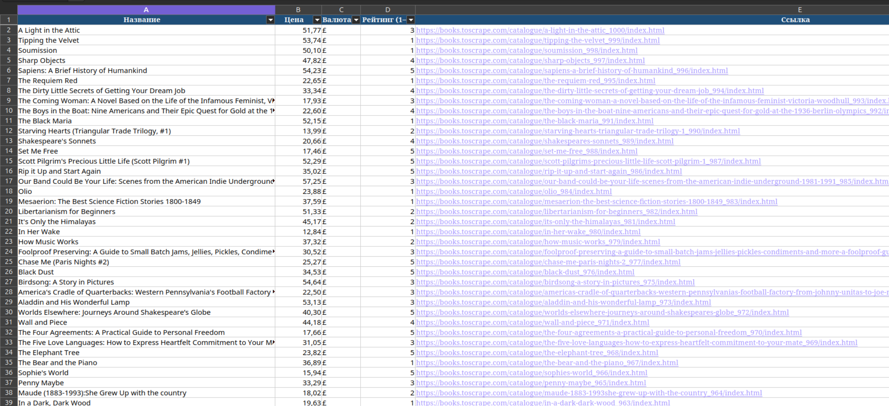

# Catalog Exporter

Сбор данных каталога интернет-магазина в форматированный Excel-отчёт.

Утилита обходит страницы каталога (пагинация), извлекает карточки товаров
и выгружает результат в `.xlsx` с оформлением: шапка, автофильтр, гиперссылки,
числовой формат цен.

## Результат



## Возможности

- обход N страниц каталога с паузами (вежливость к сайту);
- повтор запроса при временных ошибках (5xx/429) с экспоненциальной задержкой;
- корректное определение кодировки, когда сервер не отдаёт `charset`;
- нормализация цен (`£51.77`, `1 234,56 ₽` → число + валюта);
- дедупликация по ссылке на товар;
- итог — готовый Excel-файл для заказчика.

## Установка

```bash
pip install -r requirements.txt
```

## Запуск

```bash
# демо-прогон: 3 страницы → data/result.xlsx
python main.py --pages 3

# полный обход 50 страниц
python main.py --pages 50 --output data/full.xlsx --delay 0.6
```

Параметры:

| Параметр | По умолчанию | Назначение |
|---|---|---|
| `--pages` | 3 | сколько страниц каталога обойти |
| `--output` | `data/result.xlsx` | путь к итоговому файлу |
| `--delay` | 0.6 | пауза между запросами, сек |
| `--verbose` | — | подробные логи |

## Тесты

```bash
python -m pytest tests -q
```

Тесты покрывают парсинг цен, рейтингов и карточек на фикстуре HTML (без сети).

## Как устроено

```
collector.py   — сеть, пагинация, извлечение и нормализация данных
exporter.py    — формирование форматированного .xlsx
main.py        — CLI-точка входа
tests/         — unit-тесты на фикстуре
```

Адаптация под другой каталог: в `collector.py` меняются CSS-селекторы карточки
(`SELECTORS`) и шаблон URL страниц. Остальной код не зависит от конкретного сайта.

## Структура выходного файла

| Название | Цена | Валюта | Рейтинг (1–5) | Ссылка |
|---|---|---|---|---|
| A Light in the Attic | 51.77 | £ | 3 | https://… |

Демо-прогон выполнен на публичном учебном каталоге books.toscrape.com
(стабильный и разрешённый для автоматизации источник); движок переносится
на целевой сайт заказчика заменой селекторов.
